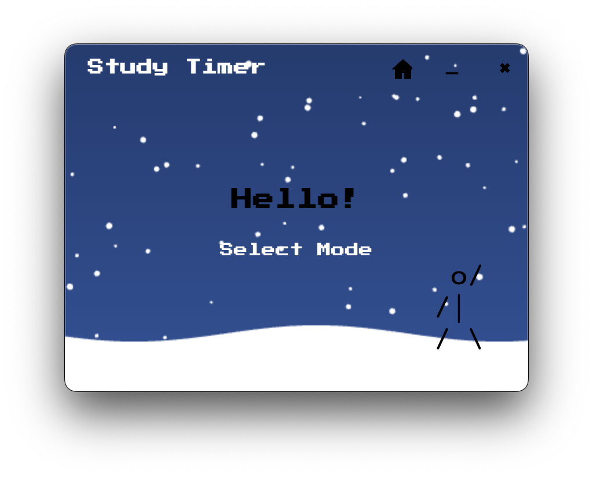
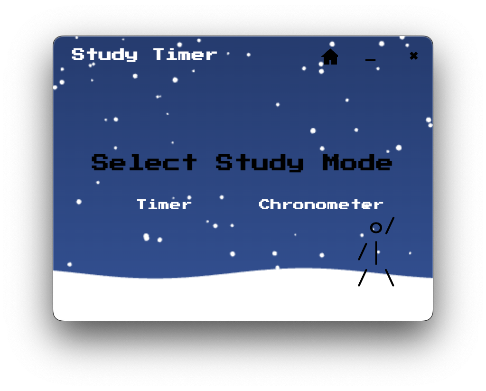
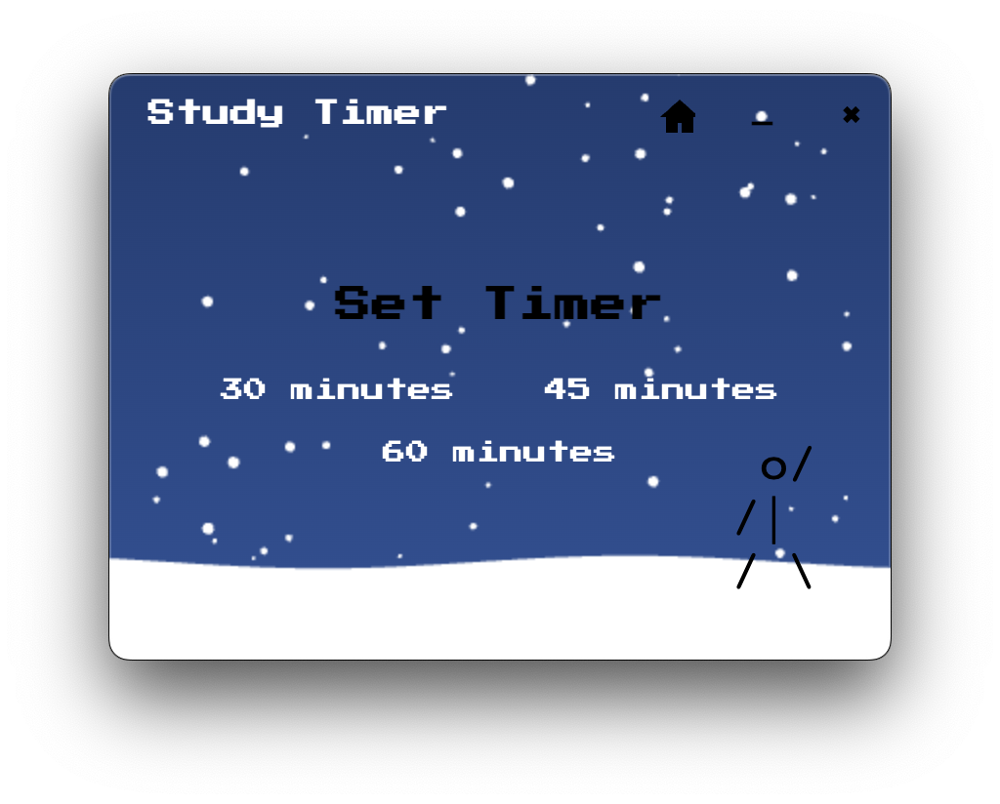
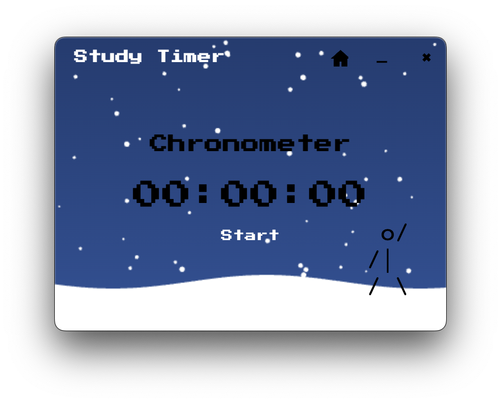

# Study Timer

A simple, pixel-style study timer desktop app built with Electron.  
Easily switch between a countdown timer and a chronometer to help manage your study sessions.

---

## Features

- **Intro Page**  
  Greeted with a friendly welcome and a snowy animated background.

  

- **Mode Selection**  
  Choose between Timer and Chronometer modes.

  

- **Timer**  
  Set a countdown for 30, 45, or 60 minutes. Start, pause, and reset as needed.  
  When the timer ends, a sound will play.

  

- **Chronometer**  
  A simple stopwatch to track your study time. Start, pause, and reset as needed.

  

---

## Installation

1. **Clone the repository:**
   ```bash
   git clone https://github.com/yourusername/study_timer.git
   cd study_timer
   ```

2. **Install dependencies:**
   ```bash
   npm install
   ```

3. **Run the app:**
   ```bash
   npm start
   ```

---

## Build

To package the app for your platform (macOS, Windows, or Linux):

```bash
npm run build
```

The output will be in the `dist/` folder.

---

## Project Structure

```
study_timer/
  fonts/            # Pixel-style font
  sound/            # Notification sound
  index.html        # Main UI
  main.js           # Electron main process
  snow.js           # Snow animation
  package.json      # Project metadata and scripts
```

---

## Dependencies

- [Electron](https://www.electronjs.org/)
- [electron-builder](https://www.electron.build/)

---
